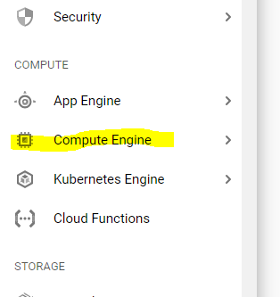
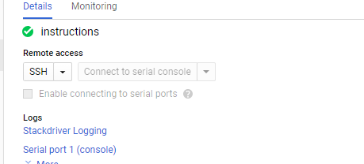

<h1>CSE 485</h1>
<h2>Data Wrappers from BigQuery to PostgreSQL</h2>
<h3>Insturctions</h3>
<ol>
  <li>Create a compute instance</li>
  
  
  
  
  
  <li>Commands:
    <ol>
        <li>sudo su</li>
        <li>apt-get update</li>
        <li>apt install docker.io</li>
        <li>git clone https://github.com/gabfl/bigquery_fdw.git</li>
        <li>curl ceclnx01.cec.miamioh.edu/~gentilm5/key.json >> key.json</li>
        <li>docker run -v $(pwd)/bigquery_fdw:/opt/bigquery_fdw -v $(pwd)/key.json:/opt/key/key.json -ti gabfl/bigquery_fdw</li>
        <li>Congrats. You're now in Docker</li>
        <li>python3 setup.py install</li>
        <li>This data wrapper is now installed. You can now run my code or the one provided in the repo. Mine shows you how to run from my databases. There is a known error with the connection tester not accepting dashes</li>
        <li>To run mine run "git clone https://github.com/SegmentFaults/CSE485FDW.git"</li>
        <li> su postgres -c 'psql -f CSE485FDW/testScripts/customSetup.sql -d fdw'</li>
        <li> su postgres -c 'psql -f CSE485FDW/testScripts/customQuery.sql -d fdw'     *TO GET OUT JUST PRESS Q<li>
    </ol>
 </ol>

 When you're done make sure to STOP your servers

